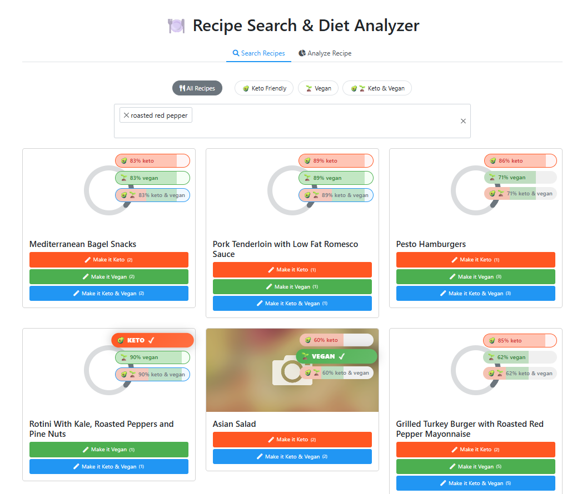
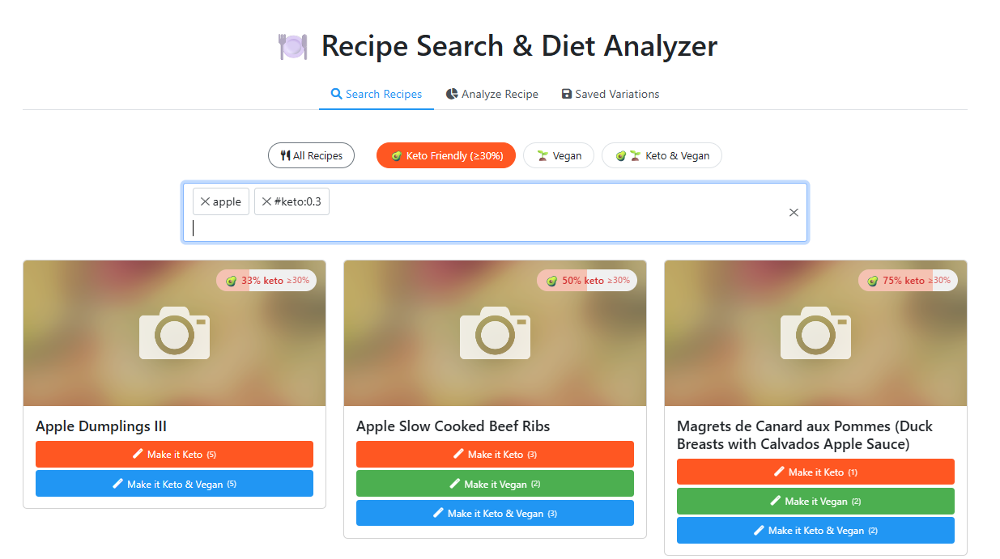
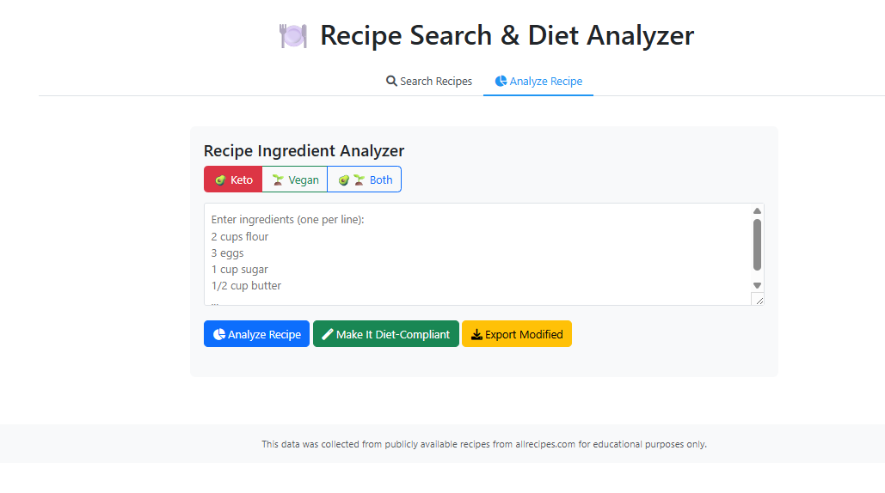
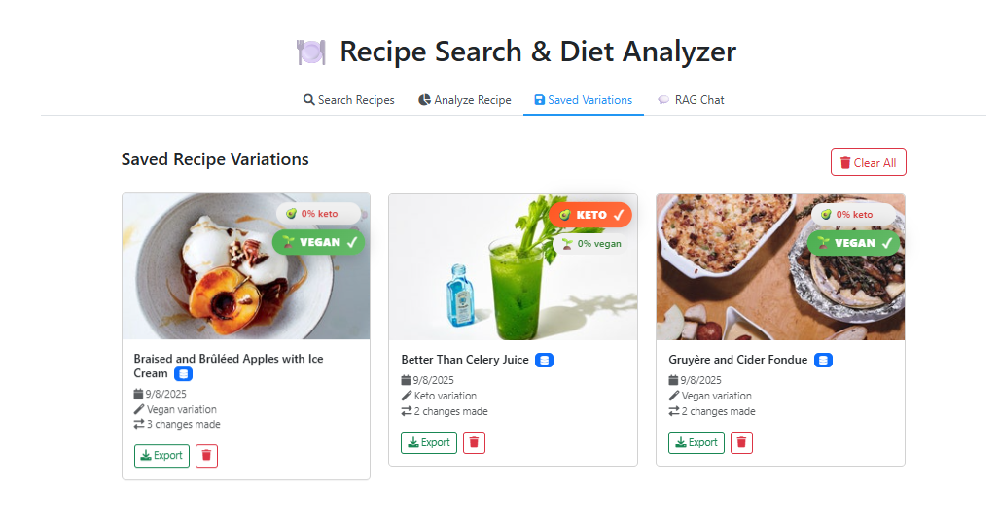
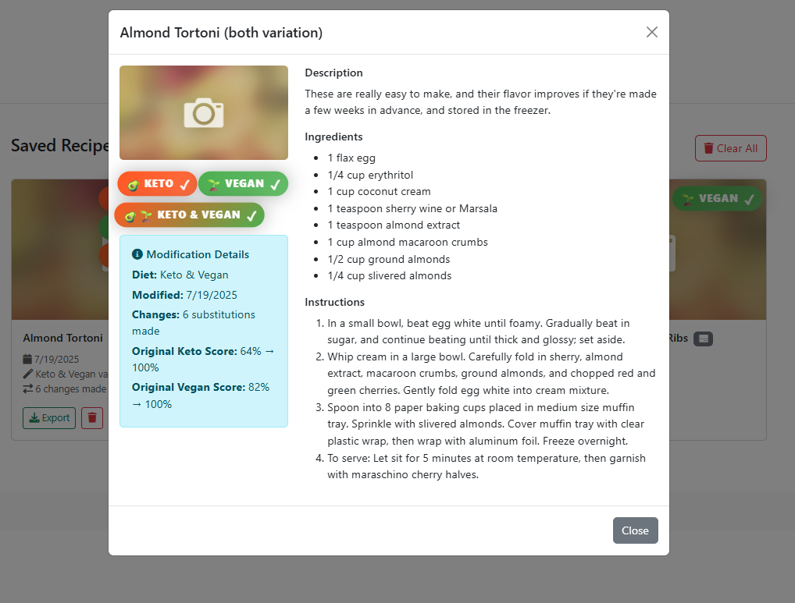

# 🥑 Search By Ingredients 2.0: Multi-Diet, Portion-Aware, and Transformative Recipe Search  
### Originally built as a solution to [Argmax's Search By Ingredients Challenge](https://github.com/v1t3ls0n/search_by_ingredients/blob/main/nb/src/task.ipynb)

> **v3 IN PROGRESS — RAG Chat++**  
> Version 3 is currently in development, expanding the project with a **RAG (Retrieval-Augmented Generation) Chat** experience.  
> We run **local LLMs via Ollama** by default, add **hybrid retrieval (BM25 + embeddings)**, **inline citations**, **multi-turn memory (lightweight)** and **tool-use** (call search/substitutions/exports directly from chat).  
> Backend remains **pluggable** (Ollama now; HF/Transformers later). ETA: soon™️.

---

## Table of Contents
- [Original Challenge (Argmax)](#original-challenge-argmax)
- [Major Upgrade: "Search By Ingredients 2.0"](#-major-upgrade-search-by-ingredients-20)
- [3.0 Roadmap (Work in Progress)](#-whats-next--30-roadmap-work-in-progress)
- [Task Requirements vs My Solution](#-task-requirements-vs-my-solution)
- [The Solution: Portion-Aware, Multi-Diet, Transformative](#-the-solution-portion-aware-multi-diet-transformative)
- [Architecture & Module Structure](#-architecture--module-structure)
- [Major Features](#-major-features)
- [Performance](#-performance)
- [API Endpoints](#-api-endpoints)
- [Usage Examples](#-usage-examples)
- [Future Improvements](#-future-improvements)
- [Summary](#summary)
- [Bonus: Over-Engineered ML Solution](#-bonus-over-engineered-ml-solution-way-beyond-scope)
- [Contact](#contact)

---

**Original Challenge (Argmax):**  
This project began as a practical DS/ML coding task: classify recipes as **keto** and **vegan** based on ingredients—without provided labels—using clear, verifiable definitions (e.g., vegan = no animal products; keto = no ingredient with >10g carbs/100g). The initial scope focused on implementing `is_ingredient_keto()` and `is_ingredient_vegan()` and validating results against an OpenSearch-backed recipes dataset.  
👉 See the full brief and examples in the **[🔗 Original Task Instructions](https://github.com/v1t3ls0n/search_by_ingredients/blob/main/nb/src/task.ipynb)**.

---

**Task:** Originally, implement `is_ingredient_keto()` and `is_ingredient_vegan()`.  
**Now:** The project has evolved into a powerful, extensible tool for analyzing, searching, and transforming recipes for multiple diets (Keto, Vegan, and Both) with portion-aware logic, dynamic substitutions, scoring, and UI enhancements.

---

## 🚀 Major Upgrade: "Search By Ingredients 2.0"

**What’s new in 2.0?**

* **Keto/Vegan search filters:** Find recipes by `#keto`, `#vegan`, or both.  
* **Optional `#diet:threshold` search:** Search with diet compliance thresholds (e.g., `#keto:0.8`).  
* **Visual diet badges:** Results show keto/vegan score badges. 100% scores get a strict vegan/keto badge.  
* **Recipe transformation:** Instantly convert non-keto/non-vegan recipes to fully compliant ones with substitution logic.  
* **Ingredient analysis UI:** Visualizes per-ingredient compliance and suggests improvements.  
* **Portion-aware diet logic:** Tiny amounts of “forbidden” ingredients allowed if they don’t practically affect diet compliance.  
* **Multi-diet intersection:** Find and create recipes that satisfy several dietary restrictions at once.  
* **Dynamic substitution system:** Combines and enhances substitutions for multiple diets (e.g., “unsweetened almond milk” for both keto and vegan).  
* **Real-time diet scoring:** Percentage-based compliance, badge gradients for partial matches.  
* **API and CLI support:** Powerful endpoints and batch tools for search, analyze, and export.  
* **Automatic recipe saving:** All modified recipes automatically saved to database with unique ID management.  
* **Saved variations management:** View, export, and manage all recipe modifications with detailed history.

---

## 📢 What’s Next — **3.0 Roadmap (Work in Progress)**

**RAG Chat++ (current focus)**
* **Natural, non-robotic** responses with instruction-tuned prompting and style controls  
* **Multi-turn chat** with lightweight session memory (user preferences + recent context)  
* **Source-grounded answers** with inline citations and per-source diet scores  
* **Tool-use from chat**: structured calls into search, substitutions, and export endpoints  
* **Diet-aware intents**: auto-detect “make this vegan”, “keto dinner for two”, “replace eggs”, etc.

**Local-First LLMs & Backends**
* Default backend: **Ollama** (e.g., Llama 3.1)  
* Pluggable alt-backends: **Hugging Face Transformers** (for gpt-oss-20b or similar)  
* Optional **reranking** (cross-encoder) for retrieval precision  
* Guardrails & deterministic formatting for lists/steps/ingredient tables

**Retrieval & UX**
* Faster **hybrid retrieval** (BM25 + embeddings) with dedupe & re-scoring  
* **Inline exports** from chat (Markdown/JSON/CSV packs)  
* “Teaching mode”: show **why** a suggestion is keto/vegan-friendly  
* Future **multimodal**: image → recipe search (CLIP/BLIP/Florence-2)

> Track progress on `rag-chat-v3/*` PRs. Local-first by default; cloud backends remain optional.

---

## 📋 Task Requirements vs My Solution

### What Was Asked
* Implement `is_ingredient_keto()`  
* Implement `is_ingredient_vegan()`

### What I Delivered
* Full, unified classification logic for both diets with USDA integration  
* Portion-aware net carbs analysis for real-world keto compliance  
* Multi-diet logic, scoring, and UI  
* Instant recipe transformation and dynamic substitutions  
* Search, analysis, and export tools

---

## 🧠 The Solution: Portion-Aware, Multi-Diet, Transformative

### Core Innovations

#### 1. Portion-Aware Diet Classification
Traditional systems are binary. Now, small amounts of “forbidden” ingredients are allowed if their per-serving impact is negligible.  
*Example:* 1/4 tsp vanilla in a cake is now accepted for keto.

#### 2. Multi-Diet Compliance and Intersection
Find, score, and transform recipes for any combination of diets. Dynamic substitutions are computed, not hardcoded.

#### 3. Diet Threshold Filters
Use queries like `#keto:0.8` or `#both:0.7` to filter for partial compliance.

#### 4. Visual Diet Badges
Recipes display color-coded badges and compliance percentages for each selected diet. 100% compliance gets a strict badge.

---

## 🏗️ Architecture & Module Structure

```

utils/
├── classifiers.py      # Core classification logic
├── constants.py        # Diet lists & substitutions
├── portions.py         # Net carbs logic
├── scores.py           # Scoring
├── substitutions.py    # Dynamic replacements
├── query\_flags.py      # Search syntax
└── usda.py             # Nutrition data

```

* **Unified Classifier:** Shared logic, diet-specific only when needed.  
* **No Redundant Data:** “Both” substitutions are computed dynamically.  
* **Layered Matching:** Regex, normalization, USDA lookup, and intelligent token analysis.  
* **Percentage Scoring:** Shows how close a recipe is to each diet.

---

## ✨ Major Features

### Visual Diet Indicators
* Badges and pills for each recipe  
* 100% = strict badge; partials show percentage  
* UI toggles diet info based on search



### Threshold-Based Diet Filtering
* `#keto:0.8` — at least 80% keto-compliant  
* `#vegan:0.9` — at least 90% vegan-compliant  
* `#both:0.7` — at least 70% compliant for both



### Recipe Analysis & Conversion Interface
* Select diet mode (keto, vegan, both)  
* Input/parse ingredients with quantities  
* Real-time scoring and suggestions  
* Export fully converted recipes  
* Convert any recipe to keto, vegan, or both



### Dynamic Substitution System
* Single-diet and multi-diet substitutions  
* Examples:
  * Flour → almond/coconut flour (both)  
  * Milk → unsweetened almond milk (both)  
  * Eggs → flax eggs (with “use sparingly” for keto)


### Saved Recipe Variations
* Auto-saves to DB with unique IDs (no duplicates)  
* Unified view (database + localStorage) with badges  
* Export/delete per variation  
* Tracks before/after scores and changes

  


---

## ⚡ Performance
* ~460 recipes/second  
* Fast regex and USDA caching  
* Batch indexing for scoring

---

## 📚 API Endpoints

### Core Functionality
1. `GET /` — Main UI  
2. `GET /search` — Recipe search with diet filters  
3. `GET /select2` — Ingredient autocomplete  
4. `GET /substitutions` — Substitution engine  
5. `POST /modify-recipe` — Apply substitutions  
6. `GET /check-compliance` — Compliance scoring  
7. `GET /export-modified` — Export recipes  
8. `POST /convert-recipes` — Batch conversion

### Database Management
9. `POST /save-modified-recipe` — Save recipe variation to database  
10. `GET /get-modified-recipes` — Retrieve saved recipes (filter by `id`, `diet`, `title`, `unique_id`)  
11. `DELETE /delete-modified-recipe/<id>` — Delete specific variation  
12. `DELETE /clear-all-modified-recipes` — Clear all saved recipes

---

## 💡 Usage Examples

### Find Keto-Vegan Recipes
```

Search: "lunch #both"
→ 100% compliant recipes

```

### Convert a Recipe
```

Original: \["2 cups flour", "1 cup sugar", "3 eggs", "1/2 cup butter"]
Converted: 100% keto-vegan compliant

```

### Partial Compliance Search
```

Search: "#both:0.7"
→ Results with at least 70% compliance for both diets

```

### Save and Manage Recipe Variations
1. Apply diet substitutions to any recipe  
2. Recipe automatically saved to database  
3. View all saved variations in "Saved Variations" tab  
4. Export or delete individual variations  
5. Track modification history and compliance improvements

---

## 🔮 Future Improvements
* More diet combos (paleo, gluten-free, custom)  
* Weighted compliance (main vs. minor ingredients)  
* Smart quantity adjustments for substitutions  
* Community ratings for substitution success

---

## Summary
**Search By Ingredients 2.0** transforms simple diet classification into a comprehensive, practical tool.

* **Quantity matters**: Portion-aware logic for real-world compliance.  
* **Diets intersect intelligently**: Dynamic, maintainable substitution logic.  
* **Context enhances compliance**: “Use sparingly” and “unsweetened” bridge gaps.  
* **UI follows intent**: Visual cues reduce cognitive load.  
* **Persistent management**: Auto-save with dedup.  
* **Complete workflow**: Search → Modify → Save/Export.

**3.0** will bring a much smarter **RAG Chat** experience with better answers, citations, multi-turn memory and tool-use—powered by **Ollama as the default local LLM backend** while staying local-first and hackable, with optional HF/Transformers support.

---

## 🤖 Bonus: Over-Engineered ML Solution (Way Beyond Scope)
**Note:** The task only asked to implement two functions. The rule-based solution above completely solves it with 100% accuracy.

For those curious about "what if we went completely overboard?", I created an entirely optional ML solution on the `ml-overkill-solution` branch. This is a **9000+ line production ML system** organized into **40+ modules**—essentially what you'd build for a Fortune 500 company, not a classification task.

### What's in the ML branch
- Complete weak supervision pipeline with silver labeling  
- Multi-modal learning (text + 70K images)  
- 15+ ML models with 4-level hierarchical ensembles  
- Full production infrastructure (GPU support, memory management, error handling)  
- Modular architecture: `silver_labeling/`, `feature_engineering/`, `models/`, `ensemble/`, etc.

### Why build something so excessive?
Pure engineering showcase. It demonstrates the ability to architect large-scale ML systems even when a simple solution suffices. The ML system achieves F1-scores up to 0.963 (worse than the 100% rule-based solution!) while being 30× more complex.

**Bottom line:** The rule-based solution is the right answer. The ML branch is there if you want to see what "throwing everything at the problem" looks like.

---

## Contact
🔗 [Linkedin](https://www.linkedin.com/in/guyvitelson/)  
🐙 [GitHub](https://github.com/v1t3ls0n)  
✉️ [Mail](mailto:guyvitelson@gmail.com)
